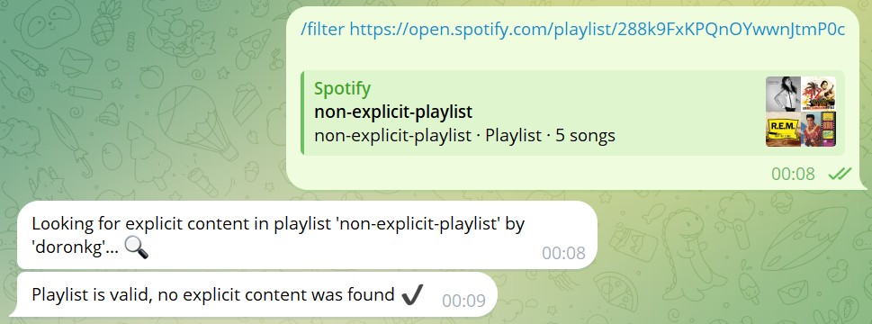
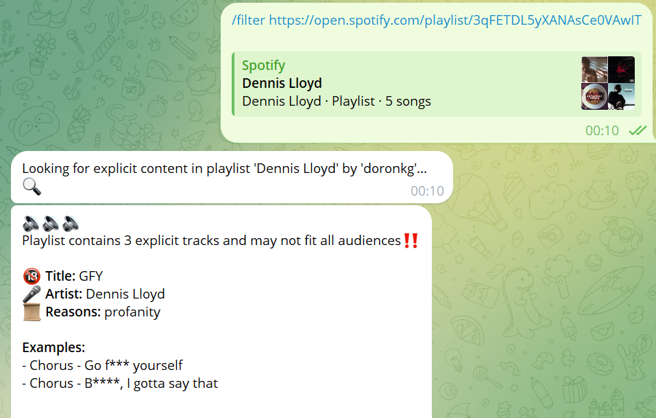

[](https://github.com/pylint-dev/pylint)
[](https://github.com/auchenberg/volkswagen)


# Spotifilter

Spotifilter harnesses ChatGPT to effortlessly filter explicit tracks from your Spotify playlists, ensuring a clean and family-friendly listening experience, and is brought to you as a free-to-use, handy Telegram bot!

# Telegram Bot

`@spotifilter_bot` currently supports the following commands:
1. `/filter` - Filter public Spotify playlist by ID / link.
2. `/report` - Report an issue or request feature.

## Examples




## Limitations

1. `Spotifiler` was only tested on English-language playlists.
2. `/filter` command can only accept input in the same message and not as a conversation.

# Self Hosting

In order to use `Spotifilter`, one must acquire 3 types of API credentials:

1. Spotify Client ID & Secret, read more [here](https://developer.spotify.com/documentation/web-api).
2. GeniusLyrics Access Token, read more [here](https://docs.genius.com/#/getting-started-h1).
3. OpenAI API Key, read more [here](https://platform.openai.com/api-keys).
4. Telegram User & Token, read more [here](https://t.me/BotFather).

Once you've acquired all the required credentials, fill these in under `.env` file.

In addition, `Spotifilter` makes use of multiple Python modules to enhance API capabilities against Spotify, GeniusLyrics, OpenAI and Telegram.

```bash
# (Optional - use Virtual Environment for development)
$ python -m venv .venv
$ .venv/Scripts/Activate.ps1 # PowerShell
# OR
$ source .venv/scripts/activate # bash/zsh

$ pip install -r requirements.txt
```

# Running in Docker

```
$ docker run -e SPOTIPY_CLIENT_ID=<> -e SPOTIPY_CLIENT_SECRET=<> -e GENIUS_API_KEY=<> -e OPENAI_API_KEY=<> -e TELEGRAM_TOKEN=<> -e TELEGRAM_USERNAME=spotifilter_bot -d doronkg/spotifilter:latest
```

# Running as K8s Deployment

See [k8s.yaml](./k8s.yaml) for K8s object definitions.
> __**NOTE:**__ You should manually create a Secret and set all the required credentials listed above.

# Contributing

Contributions are welcome! If you encounter any bugs or have suggestions for improvements, please open an issue in the [issue tracker](https://github.com/doronkg/spotifilter/issues).

# License

This open-source project is available under the [MIT License](LICENSE). Feel free to use, modify, and distribute it as per the terms of the license.
