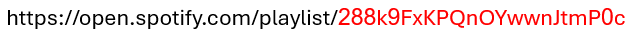

# Spotifilter
Spotifilter harnesses ChatGPT to effortlessly filter explicit tracks from your Spotify playlists, ensuring a clean and family-friendly listening experience.

# Getting Started
In order to use `spotifilter`, one must acquire 3 types of API credentials:
1. Spotify Client ID & Secret, read more [here](https://developer.spotify.com/documentation/web-api).
2. GeniusLyrics Access Token, read more [here](https://docs.genius.com/#/getting-started-h1).
3. OpenAI API Key, read more [here](https://platform.openai.com/api-keys).

Once you've acquired all the required credentials, fill these in under `.env` file.

In addition, `spotifilter` makes use of multiple Python modules to enhance API capabilities against Spotify, GeniusLyrics & OpenAI.
```bash
$ pip install -r requirements.txt
```

Now, just copy you playlist ID from the browser, and you're good to go!


# Examples
```
$ python ./spotifilter.py
Enter Spotify playlist id: 288k9FxKPQnOYwwnJtmP0c
Looking for explicit content in playlist 'non-explicit-playlist' by 'doronkg':


(1/5)
Searching for "Can't Help Falling in Love" by Elvis Presley...
Done.

(2/5)
Searching for "arms" by Christina Perri...
Done.

(3/5)
Searching for "Over The Rainbow" by Israel Kamakawiwo'ole...
Done.

(4/5)
Searching for "Losing My Religion" by R.E.M....
Done.

(5/5)
Searching for "All of Me" by John Legend...
Done.


Playlist is valid! No explicit content was found!
```

```
$ python ./spotifilter.py
Enter Spotify playlist id: 3qFETDL5yXANAsCe0VAwIT
Looking for explicit content in playlist 'Dennis Lloyd' by 'doronkg':

(1/6)
Searching for "GFY" by Dennis Lloyd...
Done.

(2/6)
Searching for "Never Go Back" by Dennis Lloyd...
Done.

(3/6)
Searching for "Leftovers" by Dennis Lloyd...
Done.

(4/6)
Searching for "Playa (Say That)" by Dennis Lloyd...
Done.

(5/6)
Searching for "Nevermind" by Dennis Lloyd...
Done.

(6/6)
Searching for "Aura" by Dennis Lloyd...
Done.


Playlist contains 4 explicit tracks and may not fit all audiences.
Do you want to see why? (y/n): y
Proceeding...

TITLE: 'GFY', ARTIST: 'Dennis Lloyd', EXPLICIT: TRUE, REASONS: ['profanity'].
- Line 18 - Go fuck yourself
- Line 20 - Bitch, I gotta say that
- Line 22 - Bitch, I gotta say that
- Line 26 - Go fuck yourself
- Line 28 - Bitch, I gotta say that
- Line 30 - Bitch, I gotta say that
- Line 46 - Go fuck yourself
- Line 48 - Bitch, I gotta say that
- Line 50 - Bitch, I gotta say that
-----------------------------------------------------------------

TITLE: 'Leftovers', ARTIST: 'Dennis Lloyd', EXPLICIT: TRUE, REASONS: ['alcoholism', 'profanity'].
- Line 1 - I'm a drunk and I will always be
- Line 4 - Fuck, I'm about to lose it all
- Line 10 - Fuck, I'm about to lose it all
- Line 15 - Fuck, I'm about to lose it all
-----------------------------------------------------------------

TITLE: 'Playa (Say That)', ARTIST: 'Dennis Lloyd', EXPLICIT: TRUE, REASONS: ['profanity', 'sex'].
- Line 7 - What you're fuckin' sayin to me
- Line 14 - How could you fuckin' say that I'm
- Line 16 - How could you say that?
- Line 43 - Say my motherfucking name
- Line 43 - While we're fucking all night long
-----------------------------------------------------------------

TITLE: 'Aura', ARTIST: 'Dennis Lloyd', EXPLICIT: TRUE, REASONS: ['sex'].
- Line 1, 2, 3, 4 - Oh, when we fuck
- Line 25 - When we fuck, oh, when we fuck
- Line 29 - When we fuck, oh, when we fuck
- Line 35 - When we fuck, oh, when we fuck
-----------------------------------------------------------------
```

# Contributing

Contributions are welcome! If you encounter any bugs or have suggestions for improvements, please open an issue in the [issue tracker](https://github.com/doronkg/spotifilter/issues).

# License

This open-source project is available under the [MIT License](LICENSE). Feel free to use, modify, and distribute it as per the terms of the license.
